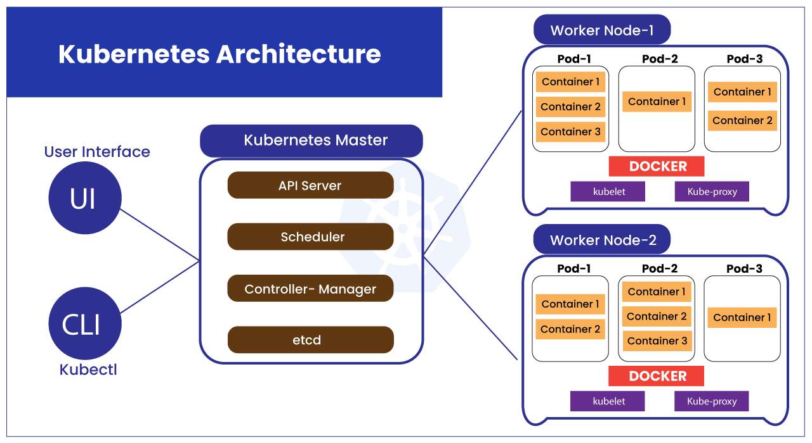

# KUBERNETES

## What is kubernetis
- Kubernetes is a open-source for orchestration of containers
- Kubernetes clusters together groups of hosts running containers, and helps you easily and efficiently manage those clusters
- It is used for automating deployment, scheduling and scaling of containerized applications, and supports many containerization tools such as Docker.

## Why kubernetis/benefits
You need a scalable application that scale automatically in demand, a self healing application. Thats when k8 comes to play

- Self Healing
   - if something goes wrong it deletes automatically, spins up a new one and it does not make a difference running the application( the user does not noticeit). if the node goes down k8 will automatically stop the traffic, redirect the traffic, terminate the faulty instance (container that has faulty node), spin a new one and redirecting the traffic again, without us creating a load balancer.

- Load Balancing and Service Dicov
   - it creates more containers if there is more demand
- Automated rollouts and rollback
   - if we build a new image, deploy it and it does not work(throghs an error) it has an option to role to a previous version
- Auto Scaling
   - 
- Automatic bin packing
   -
- Storage orchestration
   -

## kubernetes architecture
- When you deploy Kubernetes, you get a cluster.
- A Kubernetes cluster consists of a set of worker machines, called nodes, that run containerized applications. Every cluster has at least one worker node.
- The worker node(s) host the Pods (they work as wrapper for docker containers) that are the components of the application workload.
- the container has node app runnning
- each pod has its on specific ip on it, which means we have an end point to connect to

## k8 deploys replicas
our app is not scalable at the moment, but we want to scale it on demand. There are services in k8 

## kubernetes commands

`kubectl`

## Deployment of 3 pods using kubernetes

