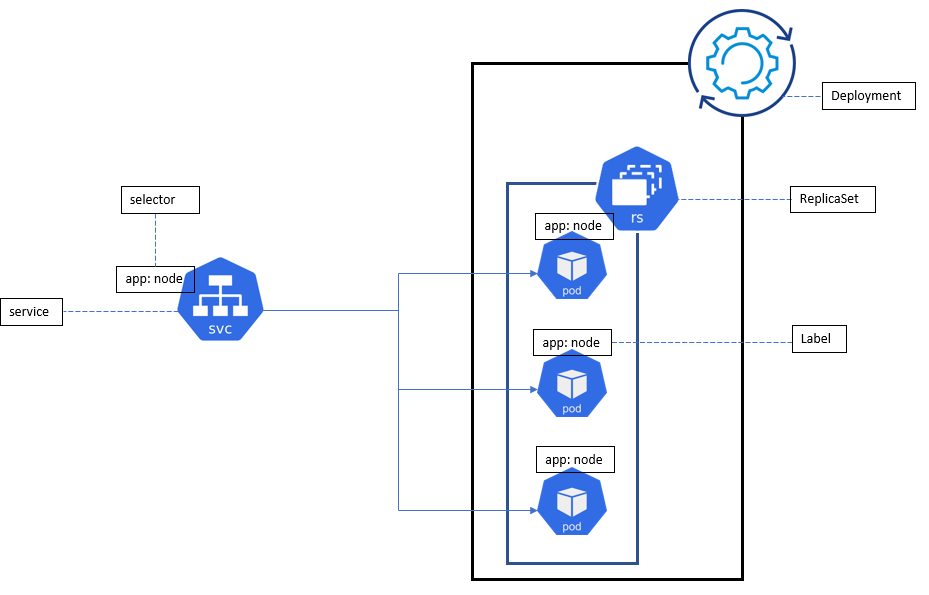

# KUBERNETES

## What is kubernetis
- Kubernetes is a open-source for orchestration of containers
- Kubernetes clusters together groups of hosts running containers, and helps you easily and efficiently manage those clusters
- It is used for automating deployment, scheduling and scaling of containerized applications, and supports many containerization tools such as Docker.

## Why kubernetis/benefits
You need a scalable application that scale automatically in demand, a self healing application. Thats when k8 comes to play

- Self Healing
   - if something goes wrong it deletes automatically, spins up a new one and it does not make a difference running the application( the user does not noticeit). if the node goes down k8 will automatically stop the traffic, redirect the traffic, terminate the faulty instance (container that has faulty node), spin a new one and redirecting the traffic again, without us creating a load balancer.

- Load Balancing and Service Dicov
   - it creates more containers if there is more demand
- Automated rollouts and rollback
   - if we build a new image, deploy it and it does not work(throghs an error) it has an option to role to a previous version
- Auto Scaling
- Automatic bin packing
- Storage orchestration

## kubernetes architecture
- When you deploy Kubernetes, you get a cluster.
- A Kubernetes cluster consists of a set of worker machines, called nodes, that run containerized applications. Every cluster has at least one worker node.
- The worker node(s) host the Pods (they work as wrapper for docker containers) that are the components of the application workload.
- the container has node app runnning
- each pod has its on specific ip on it, which means we have an end point to connect to

## Deployment of app in 3 pods using kubernetes

To create a scalable framework that scales on demand, self-heal and load balance, you need:
- Create k8 deployment with 3 pods(from app images)
- each app with their own specific ip
- k8 replica set
- ref https://learnk8s.io/deploying-nodejs-kubernetes
All this is going to be done using a file.yml ->deploy-app.yml & svc-app.yml
- After writing the files, create the files using `kubectl create -f app-deploy.yml` & `kubectl create -f app-svc.yml`
- to run the files `kubectl get deploy` & `kubectl get svc`
- to delete `kubectl delete deploy` & `kubectl delete svc`
- to check if pods are running `kubectl get pods`
- to get the info of a pod `kubectl describe <name of pod>`
- to check if the replica set were created `kubectl get rs`
- to check the configuration of file `kubectl describe deploy <name of deploy>`
- to edit and increse the number of replicas `kubectl edit deploy <name of app>` this will pop up a new window where you can edit live the replicas 
